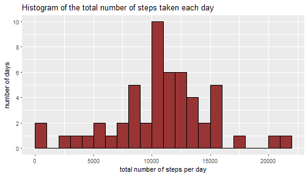
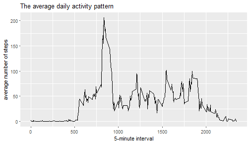
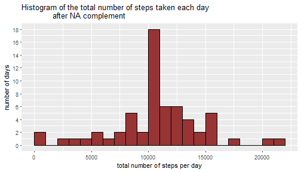
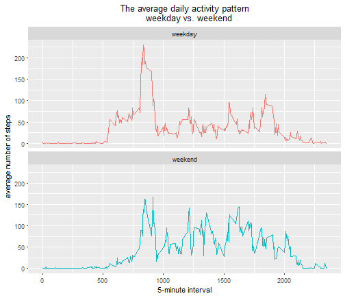

## Loading and preprocessing the data


```r
library(ggplot2)
unzip("activity.zip")
df <- read.csv("activity.csv")
df$date <- as.Date(df$date)
```

## Mean total number of steps taken per day

1.Make a histogram of the total number of steps taken each day


```r
sumByDay <- aggregate(steps ~ date, df, FUN = sum)
g1 <- ggplot(sumByDay, aes(x = steps)) +
        geom_histogram(binwidth=1000, fill="#993435", colour = "black",
                       boundary=0) +
        labs(title = "Histogram of the total number of steps taken each day") +
        labs(x = "total number of steps per day") +
        labs(y = "number of days") +
        scale_y_continuous(breaks=seq(0,12,by=2))
print(g1)
```



```r
dev.copy(png, "g1.png")
```

```
## png 
##   3
```

2.Calculate the mean and median of the total number of steps taken per day


```r
mean(sumByDay$steps, na.rm = TRUE)
```

```
## [1] 10766.19
```

```r
median(sumByDay$steps, na.rm = TRUE)
```

```
## [1] 10765
```

## The average daily activity pattern

1.Make a time series plot of the 5-minute interval (x-axis) and the average number of steps taken, averaged across all days (y-axis)


```r
dailyPattern <- aggregate(steps ~ interval, df, FUN = mean)
g2 <- ggplot(dailyPattern, aes(interval, steps)) +
        geom_line() +
        labs(title = "The average daily activity pattern") +
        labs(x = "5-minute interval") +
        labs(y = "average number of steps")
print(g2)
```



```r
dev.copy(png, "g2.png")
```

```
## png 
##   4
```

2.Which 5-minute interval, on average across all the days in the dataset, contains the maximum number of steps?


```r
dailyPattern[which.max(dailyPattern$steps), "interval"]
```

```
## [1] 835
```

## Imputing missing values

1.Calculate the total number of missing values


```r
sum(is.na(df$steps))
```

```
## [1] 2304
```

2.Fill in all of the missing values with the mean for that 5-minute interval.


```r
dfNA <- df[which(is.na(df$steps)), ]
dfNA$steps <- replace(dfNA$steps, dfNA$interval %in%
                      dailyPattern$interval, dailyPattern$steps)
```

3.Create a new dataset that is equal to the original dataset but with the missing data filled in.


```r
dfAvailable <- df[which(!is.na(df$steps)), ]
newdf <- rbind(dfAvailable, dfNA)
newdf <- newdf[order(newdf$date, newdf$interval), ]
```

4.Make a histogram of the total number of steps taken each day


```r
newSumByDay <- aggregate(steps ~ date, newdf, FUN = sum)
g3 <- ggplot(newSumByDay, aes(x = steps)) +
        geom_histogram(binwidth=1000, fill="#993435", colour = "black",
                       boundary=0) +
        labs(title = "Histogram of the total number of steps taken each day
             after NA complement") +
        labs(x = "total number of steps per day") +
        labs(y = "number of days") +
        scale_y_continuous(breaks=seq(0,20,by=2))
print(g3)
```



```r
dev.copy(png, "g3.png")
```

```
## png 
##   5
```

5.Calculate the mean and median total number of steps taken per day


```r
mean(newSumByDay$steps)
```

```
## [1] 10766.19
```

```r
median(newSumByDay$steps)
```

```
## [1] 10766.19
```

## Are there differences in activity patterns between weekdays and weekends?

1.Create a new factor variable in the dataset with two levels, �gweekday�h and �gweekend�h.


```r
Sys.setlocale("LC_TIME","us")
```

```
## [1] "English_United States.1252"
```

```r
newdf$dayofWeek <- as.factor(weekdays(newdf$date))
newdf$weekend <- as.factor(ifelse(newdf$dayofWeek=="Saturday" | 
                        newdf$dayofWeek=="Sunday", "weekend", "weekday"))
WeekendPattern <- aggregate(steps ~ interval + weekend, newdf, FUN = mean)
```

2.Make a panel plot containing a time series plot of the 5-minute interval (x-axis) and the average number of steps taken, averaged across all weekday days or weekend days (y-axis).


```r
g4 <- ggplot(WeekendPattern, aes(interval, steps)) +
        geom_line(aes(colour = weekend)) +
        labs(title = "The average daily activity pattern
        weekday vs. weekend     ") +
        theme(plot.title = element_text(hjust = 0.5)) +
        facet_wrap(~ weekend, ncol = 1) +
        labs(x = "5-minute interval") +
        labs(y = "average number of steps") +
        theme(legend.position = 'none')
print(g4)
```



```r
dev.copy(png, "g4.png")
```

```
## png 
##   6
```

